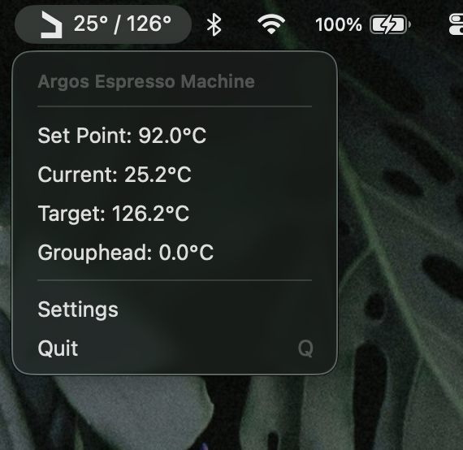

     
  Monitor your <a href="https://www.odysseyespresso.com/">argos espresso machine</a>, directly from your MacOS menubar

# ArgosMate

A menubar application for monitoring an argos espresso machine

# Installation

- Download the latest `ArgosMate.md` file from the [Releases](https://github.com/matthewnitschke/ArgosMate/releases) page
- Extract the zip file and drag the .app (will be called ArgosMate) to your Applications folder
- IMPORTANT! You will get a popup saying that ArgosMate cannot be opened. See the below section for why this, but the setting can be overwritten by going to `System Settings` -> `Privacy & Security` -> `Open Anyway`

## API Documentation

For raw data about the argos bluetooth api, see [odyssey-argos-api](https://github.com/matthewnitschke/odyssey-argos-api)